# Mini Benchmark

The MongoDB Serverless driver includes a small custom benchmark harness which attempts to replicate realistic latency for cold starts in a cloud environment for a single region replica set.

By default, the benchmark generates 48 fresh Node processes per driver and operation (192 samples total).
The timer covers client construction through the first completed operation.


## Execution

To run the benchmark and produce raw data:

```sh
npm run benchmark -- --samples 48 --local-rtt 0.5 --cross-rtt 2 --output benchmark/results/repeat.json
```

To refresh the images and linked data without changing this document:

```sh
python3 -m venv /tmp/mongodb-benchmark-plot
/tmp/mongodb-benchmark-plot/bin/pip install -r benchmark/requirements-report.txt
/tmp/mongodb-benchmark-plot/bin/python benchmark/report.py benchmark/results/repeat.json --output-dir benchmark/baseline
```

[Raw samples](benchmark/baseline/samples.json) · [Recovered connection timings](benchmark/baseline/connection-timings.json) · [SVG plot](benchmark/baseline/latency.svg) · [Harness and phase definitions](benchmark/README.md)


## Most Recent Results

### Local Results
\* These are local Docker measurements, not AWS Lambda cold-start measurements.

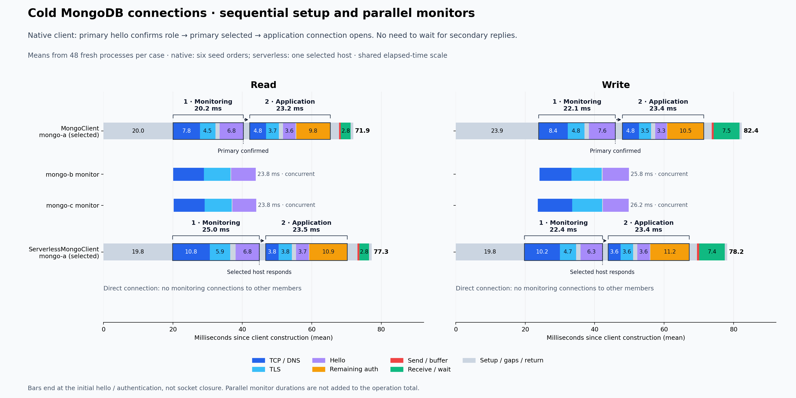

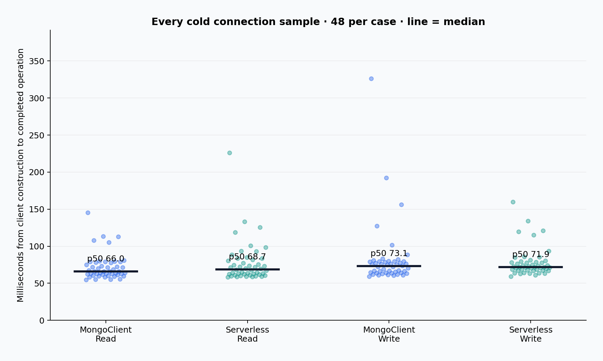

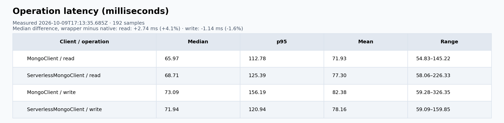

The results image includes differences in sample medians; positive means the wrapper took longer.

A single run does not establish a statistically significant performance difference.
The normal driver can select the local primary before discovery of remote members finishes.
The direct client also performs TCP, TLS, MongoDB handshake and authentication.

#### Seed order

The native client cycles through all six seed permutations. The serverless client uses one selected host and has no seed-order treatment; which client runs first is reversed on the next six-order cycle.

An explicit `mongodb://` URI supplies an ordered seed list. DNS SRV answers can arrive in a
different order, but this benchmark does not perform SRV discovery. Varying the explicit
list measures sensitivity to launch order; it does not simulate DNS lookup latency.

#### How members are discovered and connected

The native client starts with all three addresses already in its seed URI:
`mongo-a:27017,mongo-b:27017,mongo-c:27017`, with `replicaSet=benchmark`.
It starts monitoring connections to all three; their TCP, TLS and initial hello exchanges
overlap. The extra lanes show those exchanges at their measured offsets, not extra latency.

Each hello describes the responding member and replica-set membership. In replica-set mode,
the driver uses these replies to identify the primary, discover additional members and
update its topology. A seed list can contain only part of the set: discovered addresses
then receive their own monitors. This benchmark supplies all three seeds up front.

The native client does not know roles from seed order: the primary’s own hello must establish
its role before it becomes selectable. The diagram marks this as Primary confirmed.
The driver then opens and authenticates an application connection
to it. It need not wait for both secondary monitors. A pool exists for each known server,
but with `minPoolSize=0` this run opens no application connections to the unused secondaries.

The wrapper reads topology prepared by `replSetGetStatus` before timing, selects `mongo-a`,
and creates a one-host client with `directConnection=true`. That client still monitors
and authenticates separate connections to `mongo-a`, but does not follow the hello member
list to open connections to `mongo-b` or `mongo-c`.

See the [MongoDB discovery specification](https://specifications.readthedocs.io/en/latest/server-discovery-and-monitoring/server-discovery-and-monitoring/).

#### Connection start and ready times

Both clients first open a monitoring connection to the selected host and wait for its hello.
They then open a separate application connection, complete TLS, hello and authentication,
and execute the command. Direct connection mode still performs both connections.

All times below are means in milliseconds, relative to client construction. Connection 1
ends when its initial hello returns; its monitoring socket remains open. Connection 2
is ready when authentication finishes. These are setup durations, not socket lifetimes.

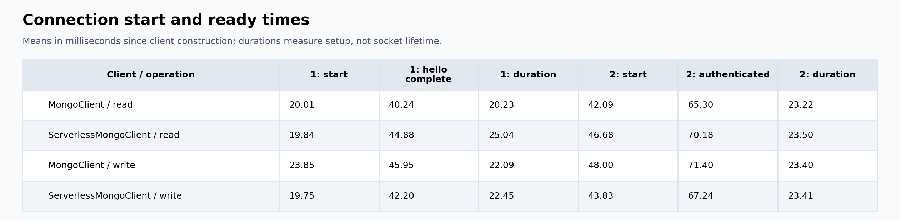

#### Where the former Other / discovery time went

The original chart subtracted only application-socket phases. It therefore put the entire
initial monitoring connection in Other. The saved traces recover the intervals below
without rerunning the benchmark. Remaining gaps are measured intervals, not CPU profiles.

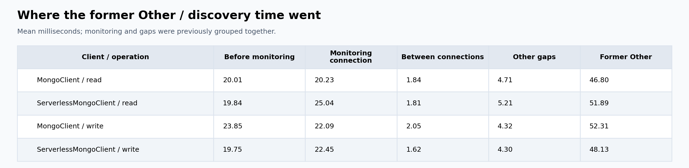

#### Native client by seed order

The serverless client has no seed-order treatment: it chooses one host from the supplied topology.

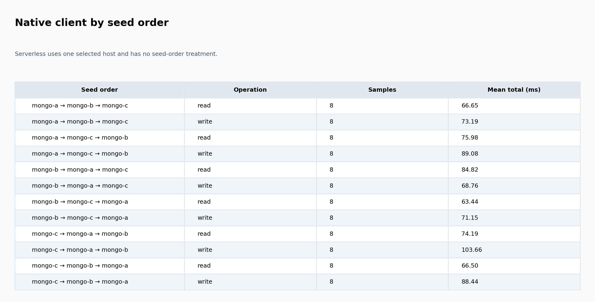

Before monitoring includes client configuration, CA-file reading and topology setup;
the wrapper also prepares routing. The traces do not separate those costs. Between
connections covers the transition from the monitor reply to starting the application socket.
The remaining gaps occur between connection phases, before command dispatch and on return.

#### Mean connection phases

The timeline places these phases inside the two outlined connection intervals.
The chart uses means so sequential segments add to mean total time; medians do not.

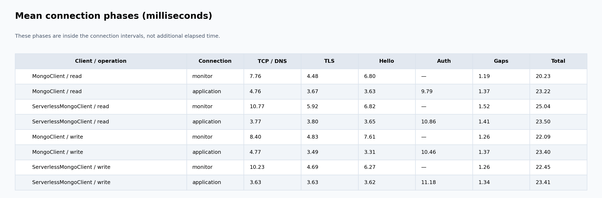

#### Mean timeline segments

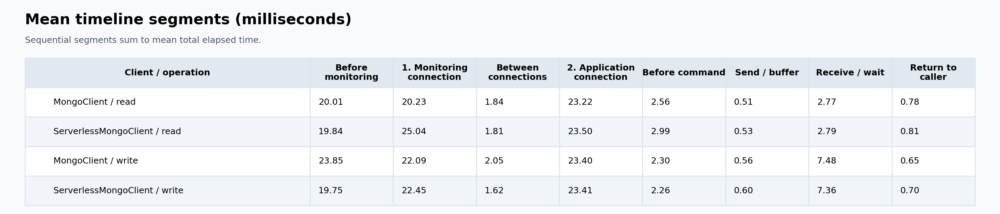

#### Network and workload

The client and primary share simulated AZ A; two secondaries occupy AZ B and C. Injected delay is split equally between packet directions. The network image records the configured and measured RTTs for the displayed run.
Measured RTTs below include Docker VM scheduling overhead. These are illustrative same-region
values; AWS describes [single-digit millisecond AZ networking](https://docs.aws.amazon.com/wellarchitected/latest/framework/rel_fault_isolation_multiaz_region_system.html).

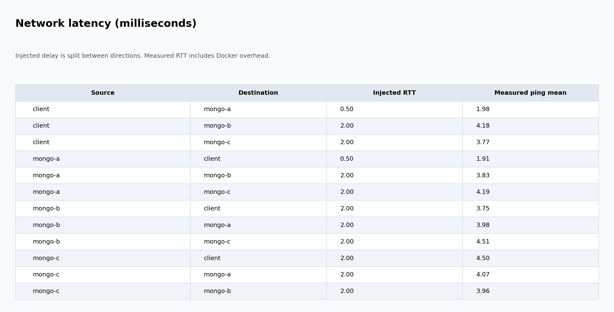

- MongoClient uses the three-member seed URI. The wrapper rewrites it to one selected host with `directConnection=true` and removes `replicaSet`.
- Both use verified TLS, SCRAM-SHA-256, a one-connection pool and no retries.
- Read: indexed `findOne` of an existing document on the primary. Write: one small `insertOne`, with majority acknowledgement.
- Every result is checked. Driver order alternates within read/write pairs. No failures are discarded.
- Topology is populated before timing; LocalPlugin reads its JSON from the process environment.
- CPU scheduling, filesystem caches, database caches and the Docker VM remain warm.

A [historical live connection check](benchmark/baseline/connection-check.json) records the
effective URIs, resolved options, topology types and socket destinations from the earlier fixed-order run for both
operations. The wrapper used `Single` topology and contacted only `mongo-a`; the
normal client used `ReplicaSetWithPrimary` and contacted all three members.

#### Measurement limits

TCP includes DNS; TLS is timed between TCP connect and secureConnect. Hello includes speculative
authentication; Auth covers the remaining SCRAM provider work. Send measures serialization and
socket buffering, not one-way network delivery. Receive/wait includes network transit, server
execution, acknowledgement and decoding. Server execution is not measured separately.

The timeline includes the selected host’s initial monitoring and application connections.
Other members are monitored concurrently; their durations are retained in the raw traces
and shown in parallel lanes, but are not added to total elapsed time. Instrumentation runs in the benchmark process
and leaves both driver implementations unchanged.

Process launch, package imports, Lambda sandbox initialization, SRV DNS and fetching topology
from a remote store are excluded. No jitter, loss or bandwidth cap is injected.


#### Environment

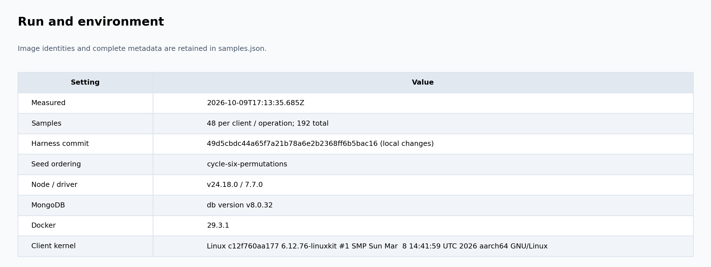

- Image identities and complete version metadata are included in the raw samples.

Database credentials and generated certificate keys are not included in the results.


### AWS Results

AWS results were collected on a sample application using the serverless client,
with MongoClient as the comparison.

[Raw samples](benchmark/aws/samples.json) · [Connection timings](benchmark/aws/connection-timings.json)

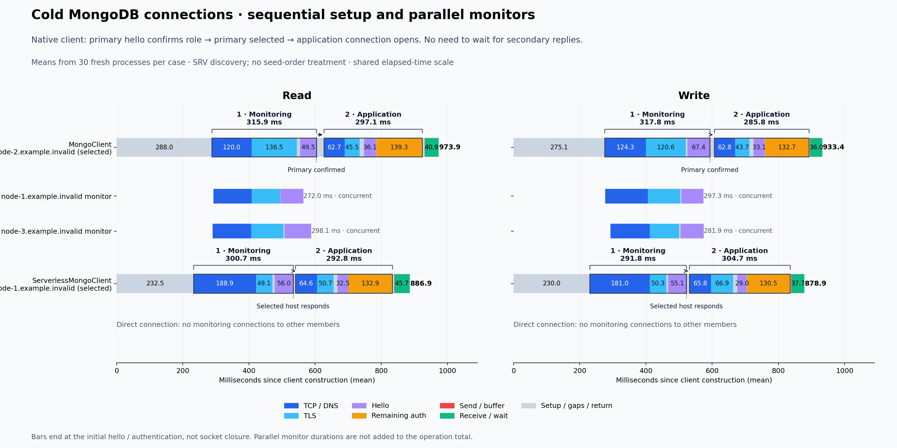

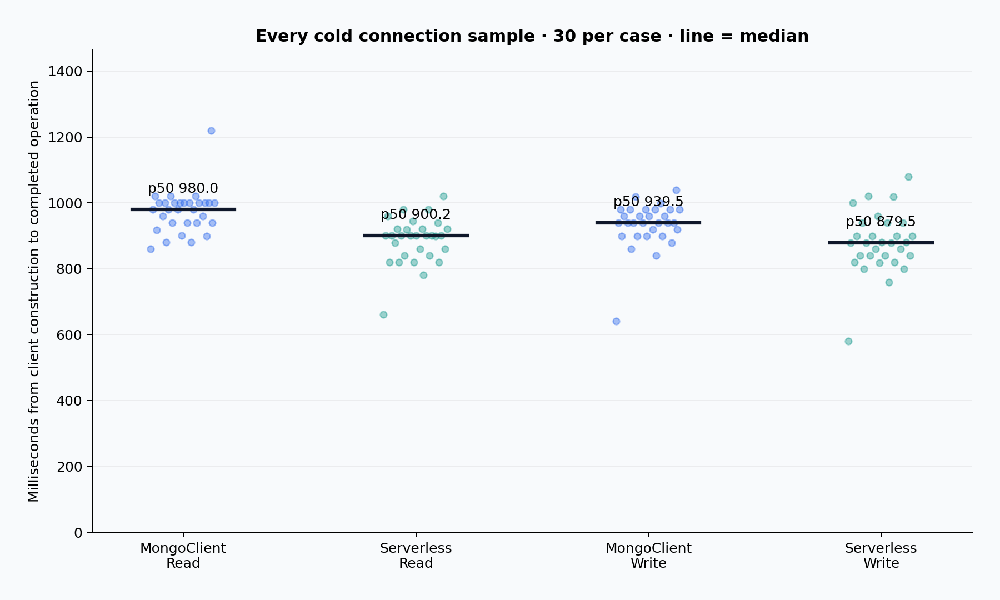

| Client | Operation | Samples | Median (ms) | p95 (ms) | Mean (ms) |
| --- | --- | ---: | ---: | ---: | ---: |
| MongoClient | Read | 30 | 980.01 | 1019.96 | 973.86 |
| ServerlessMongoClient | Read | 30 | 900.17 | 980.36 | 886.91 |
| MongoClient | Write | 30 | 939.46 | 1019.19 | 933.40 |
| ServerlessMongoClient | Write | 30 | 879.47 | 1019.69 | 878.88 |


Timings cover client construction through the completed operation and exclude
Lambda initialization.

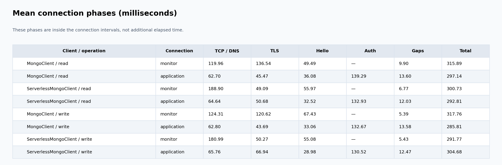
