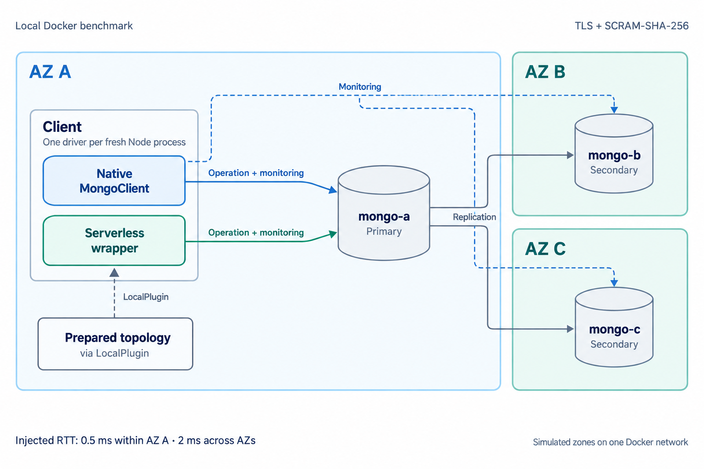

# Mini Benchmark

A small docker based benchmark which attempts to replicate a realistic cloud environment to run cold connections to the cluster. It measures the time to complete a read operation, and the time for a write operation including all phases of the connection assuming a completely new client environment similar to a serverless cold start.   

Compares the stock MongoClient and the ServerlessMongoClient against a three-member
Docker replica set with TLS, SCRAM-SHA-256 and network delay for zones within a single cloud region.



Default injected RTT: 0.5 ms within AZ A and 2 ms across AZs.

## Install

Use Node 20.19 or later, Docker Compose, and the repository's installed development
dependencies. Docker must support `NET_ADMIN` and Linux `netem`. The client runs
inside Docker, so Docker Desktop's host forwarding is outside the measured path.

## Usage

```sh
npm run benchmark
npm run benchmark -- --samples 48 --local-rtt 0.5 --cross-rtt 2 --output benchmark/results/run.json
npm run benchmark:test
```

`npm run benchmark` and `npm run benchmark:test` compile the TypeScript harness
and its driver/plugin dependencies before execution. `npm run benchmark:build`
only compiles them. The emitted files live in `benchmark/dist`; Docker copies
and runs those JavaScript files, with compilation outside the measured interval.

Each run builds two images, creates an isolated replica set,
checks all twelve directed network paths with ping, and alternates the driver
order. Each sample executes in a new Node process with a new client. The default
is 48 samples per driver per operation, or 192 fresh processes. For the native
client, all six seed orders occur eight times, with the primary appearing equally
often in each position. The serverless client uses one selected host and has no
seed-order treatment. Driver
order reverses on the next six-order cycle, balancing which client runs first.
Use a sample count divisible by 12 for complete balance. Each native sample records its
input `seedOrder`, and native-client host options and socket traces verify it.
This varies explicit URI order; it does not measure DNS SRV discovery. The harness
removes its containers, network, certificate volume and generated images when it
finishes or fails. It also prunes dangling images labelled as belonging to this
benchmark, including obsolete builds from earlier runs. Docker's build cache and
base images remain available for subsequent runs; unrelated images are untouched.
If the process is forcibly killed, remove its resources with
`docker compose -f benchmark/docker/compose.yaml down --volumes --remove-orphans --rmi local`.
Do not run two copies concurrently; the Compose project and subnet are fixed.

The client and primary are in simulated AZ A; the secondaries are in AZ B and C.
The default injected RTT is 0.5 ms within AZ A and 2 ms across AZs. Each endpoint
adds half that delay to packets addressed to the peer, including replication
traffic. Real scheduling and processing overhead adds to the configured delay.
These are illustrative values, not measurements from AWS. AWS describes same-region
AZ networking as [single-digit millisecond latency](https://docs.aws.amazon.com/wellarchitected/latest/framework/rel_fault_isolation_multiaz_region_system.html).

Both clients perform the same indexed `findOne` on the primary, or an `insertOne`
with majority acknowledgement. Reads explicitly request the primary because the
wrapper otherwise selects a secondary. Data and topology are prepared before
sampling; the serverless client reads topology prepared by `replSetGetStatus`
through LocalPlugin from the process environment. Both clients use a one-connection
pool with retries disabled. Every result is checked; no failures are discarded. TLS verifies
a generated CA and hostname. Certificates and benchmark-only credentials are
confined to the disposable Docker network; no database ports are published.

The normal MongoClient uses the full three-host replica-set URI. The serverless
wrapper rewrites that URI to the selected host with `directConnection=true` and
removes `replicaSet` before constructing its underlying MongoClient. The live test
checks the effective URI, resolved options, `Single` topology and socket targets
for both reads and writes. Connection records remove URI credentials.

A [historical live connection check](baseline/connection-check.json) records the
effective URIs, resolved options, topology types and socket destinations from the
earlier fixed-order run. The wrapper used `Single` topology and contacted only
`mongo-a`; the normal client used `ReplicaSetWithPrimary` and contacted all three members.

The JSON contains effective connection URIs and topologies, individual samples,
timestamps, selected addresses, TLS status,
connection traces, configured and measured RTTs, versions and image identities.

## Timing boundaries

The total starts immediately before client construction and ends after the first
operation resolves. Imports, process launch, cluster setup and client close are
outside this interval. `connectCallMs` is diagnostic only: the wrapper's `connect()`
does not open a database connection.

The report reconstructs a timeline from the saved socket timestamps. Both clients
first open a monitoring connection to the selected host and wait for its hello.
Only then do they open a separate application connection and authenticate it.
`directConnection=true` still uses both connections to that host. The native
client also monitors the other members concurrently. Separate lanes show their
TCP / DNS, TLS and hello at the recorded offsets; those durations are not added
to total elapsed time. The seed URI already lists all three members. Hello replies
confirm membership and roles; with an incomplete seed list, they can reveal more
members for the driver to monitor. The wrapper uses topology prepared before
timing and direct mode does not expand its one-host topology from hello replies.

The native driver learns the primary’s role from its own hello reply, not from
seed position. The Primary confirmed marker is at the end of that reply; only
then can application connection setup begin. It need not wait for secondary
replies. A pool exists for each known server, but with `minPoolSize=0` this run
opens no application connections to the unused secondaries.

See the [MongoDB discovery specification](https://specifications.readthedocs.io/en/latest/server-discovery-and-monitoring/server-discovery-and-monitoring/).

The horizontal graph has read and write columns on the same elapsed-time scale.
Each client has one bar, with outlined monitoring and application intervals.
TCP / DNS, TLS and hello appear twice at their measured positions; the second
connection also completes authentication. Brackets show each connection’s setup
duration. The sample scatter plot is a separate figure.

The timeline runs left to right from client construction to the completed operation:

| Segment | Boundary |
| --- | --- |
| Before monitoring | Client construction to the selected host's monitoring socket starting |
| 1. Monitoring connection | First socket starts to its initial hello completing; includes TCP / DNS, TLS and hello |
| Between connections | Monitor hello completes to application socket starting |
| 2. Application connection | Application socket starts to authentication completing; includes TCP / DNS, TLS, hello and remaining SCRAM work |
| Before command | Authentication completes to command entry |
| Send / buffer | Command entry to socket-write completion |
| Receive / wait | Socket-write completion to decoded command result |
| Return to caller | Decoded command result to operation resolution |

Connection durations measure setup, not socket lifetime: the monitoring socket
remains open after its first hello. Start and ready times are relative to client
construction. Means keep the sequential graph segments additive. The report also
shows the phases within each connection and writes per-sample relative timestamps
to `connection-timings.json` alongside the graphs. It rejects traces without one
completed monitor connection to the selected host before the application socket,
or with overlapping intervals, rather than inventing a timeline.

The original `timings` fields remain in the raw JSON for comparison. They describe
the application socket that served the operation:

| Phase | Boundary |
| --- | --- |
| TCP / DNS | `tls.connect()` call to the socket's `connect` event |
| TLS | TCP connect to `secureConnect` |
| Hello | Initial MongoDB handshake command, including speculative SCRAM authentication |
| Auth | SCRAM provider execution after hello, including computation and remaining exchanges |
| Send | Operation command entry to completion of the driver's socket-write method |
| Receive / wait | Socket-write completion to decoded command result; includes network, server execution and write acknowledgement |
| Other / discovery | Remaining elapsed time, including server selection, monitoring connections, plugin access, client construction and operation overhead |

Only application-socket phases are subtracted from total elapsed time. Discovery
sockets run in parallel and their durations must not be added together. Their
individual traces are retained in the JSON.

The report replaces the old Other / discovery bar with the monitoring connection
and the remaining intervals. Before monitoring includes configuration, CA-file
reading, topology setup and, for the wrapper, routing setup. The existing traces
do not separate those costs. Gaps within each connection include the transitions
between TLS, hello and authentication.

### Local results breakdown

[Latest results](../BENCHMARK.md) · [Raw samples](baseline/samples.json) · [Connection timings](baseline/connection-timings.json)

The following charts use the timing boundaries above. Connection start and ready
times are means relative to client construction. Remaining gaps are measured
intervals, not CPU profiles.


The seed-order chart applies only to the native client; the serverless client
uses one host from the supplied topology.


Means keep the connection phases and timeline segments additive; medians do not.


Measured RTTs include Docker VM scheduling overhead in addition to the configured delay.


Image identities and complete version metadata are included in the raw samples.
Database credentials and generated certificate keys are excluded.

## Limitations

Send measures serialization and local socket writing, not arrival at the server.
Receive includes the round trip and server work; a client cannot distinguish
one-way transit from server execution. Hello and speculative authentication share
one exchange, so they cannot honestly be reported as independent durations.

Instrumentation wraps Node TLS and MongoDB connection/authentication methods in
the benchmark process. It does not edit either driver on disk. Those internal
hooks are checked against MongoDB 7.7.0 and deliberately reject another version.
Instrumentation itself adds some overhead, equally enabled for both clients.

The processes are fresh, but the database, OS caches and Docker VM are warm. There
is no Lambda sandbox provisioning, package-import timing, SRV DNS, remote topology
store, jitter, loss or bandwidth cap. This is a repeatable connection-latency
experiment rather than an AWS performance prediction. Default driver discovery
is allowed to complete as soon as it finds a suitable server; it is not forced to
wait for every replica member.

To refresh the PNG and SVG images and data linked by `BENCHMARK.md`, install the
optional plotting dependency and pass a saved run to the report script. The output
directory defaults to `benchmark/baseline`. The renderer copies the input data to
`samples.json` there and refreshes `connection-timings.json`, both charts, numeric
tables and run metadata. It never writes Markdown, so edits to `BENCHMARK.md` are
preserved. A different output directory can be used for a report preview:

```sh
python3 -m venv /tmp/mongodb-benchmark-plot
/tmp/mongodb-benchmark-plot/bin/pip install -r benchmark/requirements-report.txt
/tmp/mongodb-benchmark-plot/bin/python benchmark/report.py benchmark/results/latest.json --output-dir benchmark/baseline
/tmp/mongodb-benchmark-plot/bin/python benchmark/test/report_test.py
```
